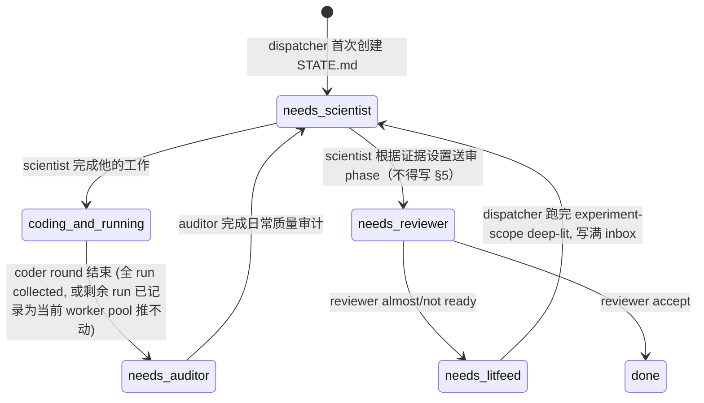
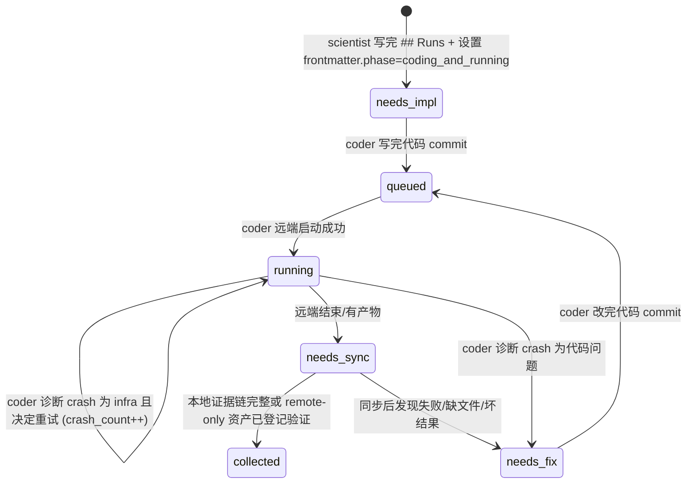

# 实验工厂手册

## 角色与分工

- experiment-scientist, "lead scientist": 读 results, 做实验路线判断（不得写 §5 人类决策）, 给 coder 写具体 plan.
- experiment-coder, "skilled ML engineer": 按 scientist 的 plan 写代码, 远程部署, 监控运行, 诊断 crash, rsync 拉回结果, 累计 GPU 工作量.
- experiment-auditor, "internal adversarial QA": scientist 前置的日常质量负责人, 审计上一轮 plan / code / results / operations, 维护 STATE.md 结构与一致性, 要求 scientist 逐条回应.
- experiment-reviewer, "adversarial reviewer": 对当前 version 做独立审查, 打分并出 verdict.

同一个 workspace 内, scientist 和 auditor 都是 singleton: 一次只允许一个 scientist 或一个 auditor 维护战略状态。coder 是 worker pool: `coding_and_running` 期间可以并行多个 coder, 各自处理不同 run, 共同组成一轮 coder round。只有整轮 coder round 结束后才交给 auditor。

scientist 及其团队 (coder) 用 git branch 管理不同实验路线 — 一条 route 写在一个 `route/<name>` branch 上, 尝试过的方向多了, git graph 会长成一棵分叉树 (成功的 route 会 merge 回 main).

用 STATE.md 记录当前的状态, git graph 每个节点都有自己的 STATE.md, 记录该节点当时的状态.

STATE.md 的内容相当于一篇文章的核心结论和数据 (含 ablation / baseline). reviewer 据此审查是否达到顶会标准, 如果不能, 指出需要补充什么.

experiment-log.md 是把 git graph 按时间倒序展平, 跨 branch 持久. 因此 experiment-log.md 不入 git — 否则 branch 切换时会丢失其他 branch 的条目.

## workspace/ 目录结构

idea factory 已经创建好 `workspace/slug/` 并跑了 pilot experiments, 但是实验工厂要以项目的要求管理 workspace.

```
workspace/slug/                               ← 独立 git repo
├── STATE.md                                  ← 当前快照, dispatcher 的唯一读入 (yaml frontmatter + markdown body)
├── topic.md                                  ← 启动时从 topics/ copy 的学科上下文, read-only
├── idea.md                                   ← 启动时从 idea 最新版 copy 的原始研究 claim, read-only
├── proposal.md                           ← 启动时从 proposal 最新版 copy, 只有 story-pivot 才能 amend
├── experiment-log.md                         ← NOT in git, 跨 branch 持久, 时间倒序 append
├── audits/                                   ← auditor reports, latest path 由 STATE.md frontmatter.latest_audit 指向
├── src/slug/{models,data,training,utils,...}/
├── conf/
├── scripts/{train.py,eval.py,sweep.sh,...}
├── data/
│   ├── MANIFEST.md                           ← reusable data / label / feature / checkpoint asset registry
│   └── ...
├── checkpoints/
├── results/                                  ← 每 run 输出子目录 `results/<run-name>/`
│   └── <run-name>/
│       ├── manifest.json                     ← run receipt: inputs, outputs, remote/local paths, sync status
│       └── train.log                         ← 训练 stdout/stderr, coder 远程启动时用 tee 写入
├── tests/
├── .venv/
└── README.md
```

## workspaces.xml 扩展 Schema

idea 工厂 pilot 阶段只写基础字段 (`idea`, `slug`, `<one-line>`). 实验工厂接管后扩展:

```xml
<workspace slug="short-slug" date="YYYY-MM-DD"
           gpu_dollars_equivalent="N.NN">           <!-- 仅 coder 写 -->
  <one-line>沿用 idea 工厂 pilot 阶段的一句话</one-line>
</workspace>
```

## Git Branch 命名

- `main` — 已接受的进展, 只通过 merge 写入
- `route/<route-name>` — 技术路线分支

操作:
- 每个新思路(route)从 main 开新分支 `cd workspace/slug`, `git checkout main`, `git checkout -b route/<name>`
- 如果最终这个 route 成功则由 scientist merge 回 main
- 如果最终放弃这个 route 则 scientist checkout main 再开新分支 (旧 branch 留着不删).

## Git commit msg 格式

格式: `version <V> iter <N> <role>: <subject>`

- version, iter: 在 STATE.md frontmatter 中
- `<role>`: `auditor` / `scientist` / `coder` / `reviewer`
- `<subject>`: ≤ 70 char, 一句话描述本次提交核心. run-name 可放 subject

## STATE.md 格式

STATE.md 在 git 里, 随 branch 切换. Agent 读此文件做决策. 初始骨架见 `CLAUDE_PLUGIN_ROOT/templates/state-template.md`.

STATE.md 的 frontmatter 记载了项目级别(branch级别)的状态, STATE.md 的 `## Runs` 章节记载每个小实验的进度. dispatcher 据此调度.

frontmatter.phase 枚举:

| Phase | 含义 | dispatcher 对此 workspace 的动作 |
|-------|------|-----------|
| `needs_auditor` | 需要 auditor 做日常质量审计, 然后交给 scientist | 派 auditor; auditor 写 audit report 后置 `needs_scientist` |
| `needs_scientist` | 需要 scientist 分析 / 规划 / 收尾 | 派 scientist |
| `coding_and_running` | coder worker pool 正在写代码 + 远端跑实验 | 并行派 coder; 整轮 coder round 结束后进入 `needs_auditor` |
| `needs_reviewer` | scientist 根据证据设置送审 phase（不得写 §5 人类决策） | 派 reviewer |
| `needs_litfeed` | reviewer 刚出 verdict, 需补一轮文献再交回 scientist | 跑一次 `deep-lit-tick --scope experiment <slug>` 到饱和, 写完 lit-feed.md inbox 后置 `needs_scientist` |
| `done` | reviewer accept | 搞定收工 |

frontmatter.phase 状态转移图 (workspace 级):



`needs_auditor` 是 coder → scientist 的前置门禁。auditor 不替 scientist 返修计划, 但会要求 scientist 下一轮逐条回应 audit findings; 下一轮 auditor 必须检查 scientist 是否回应、coder 是否落实。`needs_litfeed` 在 reviewer → scientist 这条路径上插入文献补充; litfeed 后直接交给 scientist。scientist 不论从哪条路径进来, 开工第一步都看 lit-feed.md 的 `unprocessed`, 非 0 就先消费 inbox。

Runs 的每个 run (experiment-to-run) 有自己的 phase, 由 coder worker pool 消费. dispatcher 不做研究判断, 但可以用 run.phase 和 active coder session 判断是否还在同一轮 coder round。顶层 `coding_and_running` 期间只派 coder; 多个 coder 必须处理互不冲突的 run, 避免重复部署同一实验。

Per-run phase 枚举:

| Phase | 含义 | coder 下一轮看到后怎么做 |
|-------|------|--------------------------|
| `needs_impl` | 代码未写, 等 coder 按 plan 实现 | 按 `## Experiments-to-do` 写代码 commit → `queued` |
| `queued` | 代码就绪未发射, 或崩后代码已修好待重排 | 远端启动, 成功 → `running` |
| `running` | 远端 GPU 跑着 | ssh 探活: 存活→留原 phase; 远端结束/有产物→`needs_sync`; 崩→归因 |
| `needs_sync` | 远端已有结束状态或产物, 但本地证据链还没同步/登记完整 | 拉回或登记结果、日志、manifest 和关键资产; 完整→`collected`; 缺失/坏结果→`needs_fix` |
| `needs_fix` | 崩了且判为代码 bug | 改代码 commit → `queued` |
| `collected` | 本地已有可核查证据链, 或 remote-only 大资产已登记并验证 | 无动作 |

Runs 表 run.phase 状态转移图:



顶层 `coding_and_running → needs_auditor` 的触发由 coder round 结束决定: 所有可推进 run 已 collected, 或剩余 run 已 root-cause-first 记录为当前 coder pool 推不动, 且没有 sibling coder 仍在工作。`needs_sync` 仍是 coder 可推进状态, 不得交给 auditor/scientist。

## experiment-log.md 格式

不在 git 里, 跨 branch 持久. 新条目 prepend (时间倒序). 谁维护哪类条目:

| Agent     | 可写条目类型 |
|-----------|------------|
| auditor   | `[Audit]` |
| scientist | `[Init]`, `[Version V Start]`, `[Version V Finished]`, `[Iter N Start]` |
| reviewer  | `[Review ...]`  |
| coder     | `[Run Crash]`, `[Run Sync]`, `[Run Done]` |

## 数据与同步协议

- `data/MANIFEST.md` 是长期资产账本: 记录可复用的数据、labels、features、oracle gaps、checkpoints、derived datasets 的 id、路径、状态、来源、生成命令、上游输入、本地/远端位置和可重建方式。
- `results/<run-name>/manifest.json` 是单次 run 的 receipt: 记录 input asset ids、command/config、code commit、server/remote_dir/session/job、本地/远端 outputs、metrics、logs、sync status 和哪些结果可作为 evidence。
- 不要求所有大文件都拉回本地; 但 claim-bearing evidence 必须本地可核查, 或在 manifest 中登记 remote-only 位置、最近验证时间、检查命令/摘要。
- 未登记、标为 stale/tmp、缺同步、或缺 run receipt 的文件只能当诊断线索, 不能作为主 claim 证据。

## 注意

- HF 数据 / 模型使用服务器已配置的 `HF_HOME`.
- 非 HF 数据按项目放置: 本地放 `workspace/slug/data/`, 远端放该 server 的项目数据盘的 slug 目录下.
- `data/MANIFEST.md` 记录来源、版本、预处理命令、远端路径和可重建方式. 大 checkpoint / results 不进 git.
- 接近投稿 ddl 时间很紧张, 但是我们的服务器和经费都是充足的, 不要想着省钱, 想怎么省时间, time is the most valuable thing!
