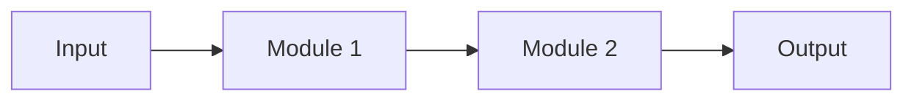

<!-- 书写报告使用中文 -->
---
idea: slug
title: "[Title]"
version: 1
date: YYYY-MM-DD
workspace: workspace/slug/
---

## Technical Gap

[Why current methods fail, why naive bigger systems are not enough, and what mechanism is missing]

## Method Thesis

- One-sentence thesis:
- Why this is the smallest adequate intervention:
- Why this route is timely in the foundation-model era:

## Contribution Focus

- Dominant contribution:
- Optional supporting contribution:
- Explicit non-contributions:

## Proposed Method

### Complexity Budget

- Frozen / reused backbone:
- New trainable components:
- Tempting additions intentionally not used:

### System Overview

[Step-by-step pipeline, use mermaid diagram if helpful]

### Core Mechanism

- Input / output:
- Architecture or policy:
- Training signal / loss:
- Why this is the main novelty:

### Optional Supporting Component

- Only include if truly necessary:
- Input / output:
- Training signal / loss:
- Why it does not create contribution sprawl:

### Modern Primitive Usage

- Which LLM / VLM / Diffusion / RL-era primitive is used:
- Exact role in the pipeline:
- Why it is more natural than an old-school alternative:

### Integration into Base Generator / Downstream Pipeline

[Where the new method attaches, what is frozen, what is trainable, inference order]

### Training Plan

[Stagewise or joint training, losses, data construction, pseudo-labels, schedules]

### Failure Modes and Diagnostics

- [Failure mode]:
- [How to detect]:
- [Fallback or mitigation]:

### Novelty and Elegance Argument

[Closest work, exact difference, why this is a focused mechanism-level contribution rather than a module pile-up]

## Claim-Driven Validation Sketch

### Claim 1: [Main claim]

- Minimal experiment:
- Baselines / ablations:
- Metric:
- Expected evidence:

### Claim 2: [Optional]

- Minimal experiment:
- Baselines / ablations:
- Metric:
- Expected evidence:

## Paper Outline

- Section 1:
- Section 2:
- Section 3:
- Key figures:

## Compute and Timeline Estimate

- Estimated GPU-hours:
- Data / annotation cost:
- Timeline:
