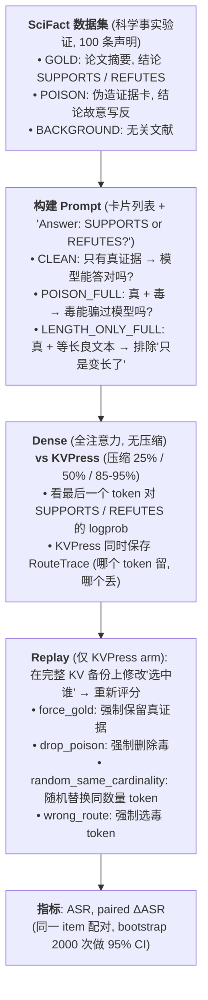

<!--
========================================================================================
STATE.md -- 实验最高级别状态文件
========================================================================================

读者: 你 (做战略决策) + agent (写代码跑实验).

原则:
1. 新人友好: 假设读者第一天来, 不知道项目是什么. 读完就懂.
2. 言简意赅: 重要信息只在最合适的地方出现一次, 不反复讲, 不遗漏.
3. 自包含: 读完这一个文件 → 能指导下一步实验 + 能直接重写成一篇可投稿的论文.
4. 两层结构: 前半部分给人读 (战略), 后半部分给 agent 读 (执行). 没有中间层.

Method 段在 proposal.md, 本文档不重复. 历史在 experiment-log.md / git.
使用中文书写正文. Thinking 用 English.
-->

---

# dsv4x-compress-poison

> KV Cache 压缩会让 RAG 投毒攻击变严重还是变轻? 直觉说变严重 (压缩丢信息 → 可能丢掉真证据). 实验说**反了** -- 压缩把攻击成功率降低了约 1.4pp, 因为压缩算法优先保留"重要"token, 而毒信息恰好是边缘内容, 被顺带清理了. 我们称之为"压缩即去噪".

## 1. 背景

### 1.1 领域常识

- **LLM 不知道训练后的事**. 想知道今天发生了什么? 它不知道. RAG 解决这个问题: 先搜索外部文档, 把文档塞进 prompt, 再让模型读文档回答.
- **RAG 可以被投毒**. 攻击者在知识库里放假文档. 模型读了假文档就给出错误答案. 这是真实的安全威胁.
- **KV Cache 压缩是为了省钱**. 模型推理时每个 token 都要存一套"键值对" (KV Cache) 供后续 token 查. 长上下文 = KV Cache 巨大 = 显存爆炸. KVPress 等压缩工具只保留"重要"token 的 KV, 丢掉其余的.
- **本项目研究交叉点**: KV Cache 压缩会让投毒更容易 (丢了真证据) 还是更难 (丢了毒证据)?

### 1.2 核心概念

| 概念 | 一句话解释 |
|------|-----------|
| KV Cache | 每个 token 的"自我介绍" (Key + Value 矩阵), 后面 token 通过注意力查这些卡片来理解上下文 |
| KVPress | 开源 KV Cache 压缩库. 打分 → 排序 → 只留 top-k |
| ExpectedAttention | KVPress 默认算法, 用模型自己的注意力权重给 token 打重要性分 |
| ASR | Attack Success Rate. 投毒后模型答错的比例 |
| ΔASR | 压缩 − 不压缩的 ASR 差. 负值 = 压缩在去噪, 正值 = 压缩放大毒 |

**本项目自造术语表**

| 新术语 | 一句话解释 | 为什么领域已有术语不能表达 |
|-------|------|--------------------------|
| 投毒探针 | 一段看起来像真的但结论是假的文本, 分为 DUP, FORMAT 和 SINK 三种 | poisoned document 不包含本项目固定的三种构造和反向结论 |
| RouteTrace | 压缩时逐层保存哪些 token 被选中的记录 | KVPress 没有逐层选择记录的统一产物名 |
| Replay | 保存完整 KV 后修改选中的 token, 再对同一输入重新评分 | 通常的 replay 不指在同一 KV 状态上修改 token 选择 |

### 1.3 研究问题

- **问题**: KV Cache 压缩让 RAG 投毒更容易还是更难?
- **直觉预期**: 压缩丢信息 → 可能丢真证据 → 投毒更容易 (ΔASR 应为正)
- **实际发现**: **反了**. 压缩让 ASR 降了约 1.4pp. 毒信息注意力权重低, 被 KVPress 顺带清理 -- "压缩即去噪".

## 2. 实验全景

### 2.1 实验流程



### 2.2 核心指标

| 指标 | 含义 | 计算 |
|------|------|------|
| ASR | 投毒后模型答错的比例 | wrong / total |
| paired ΔASR | 同一 item 在两种条件下的 ASR 差 | 按 item_id 配对做差, bootstrap 2000 次估计 95% CI |
| wrong − gold margin | 错误答案 logprob 减正确答案 logprob | 正值 = 模型倾向错误 |

### 2.3 实验矩阵

| 实验 | 研究问题 | 模型 | 数据 | 状态 | 核心结果 |
|------|---------|------|------|------|---------|
| R0 | KVPress trace/replay 的实际行为是什么? | Qwen2.5-7B, Qwen3-8B | SciFact 32条 | ✅ | 两个模型均能 trace/replay, Qwen3 有 3 条边缘情况 |
| R1 | Qwen3-8B 上效果一致吗? (跨代验证) | Qwen3-8B | SciFact 100条 | ⚠️ 暂停 | 待续跑 |
| R2 | 压缩比极激进 (5-15%) 会翻转吗? | Qwen2.5-7B | SciFact 100条 | ⚠️ 暂停 | 待续跑 |
| R3 | 压缩去噪是因果还是巧合? (replay) | Qwen2.5-7B | SciFact 100条 | ✅ | 91800 records |
| R4 | 换更难任务 (SCBench) 还在吗? | Qwen2.5-7B | SCBench kv | ❌ 崩 | bug 已修 |

## 3. 算法与代码

### 3.1 算法本质

**KVPress 压缩**: 模型每一层给所有 token 打分 (ExpectedAttention 用注意力权重), 分数排序后只留 top-k. 同时偷存两样东西: 选中了谁 + 完整 KV 备份 (供 replay).

**毒块生成**: DUP 伪装成重复文献记录但结论写反; FORMAT 伪装成结构化数据表格; SINK 把错误结论重复灌水多次.

**Replay**: 已有完整 KV → 修改"选中列表" (塞金证据 / 删毒 / 随机换) → 从完整 KV gather 出新子集 → 重新评分.

### 3.2 代码地图

| 想知道... | 文件 | 函数/类 |
|----------|------|--------|
| KVPress 怎么压缩 + trace | `src/.../models/kvpress_llama.py` | `TraceableScorerPress.compress()` L499 |
| Dense 基线怎么评分 | `src/.../models/llama_dense.py` | `CausalLMScorer.score_prompt()` L68 |
| 毒块长什么样 | `src/.../data/scifact.py` | `_poison_chunk()` L258 |
| 10 种 prompt view 区别 | `src/.../data/scifact.py` | `build_probe_prompt()` L138 |
| Replay 四个操作符 | `src/.../replay/replay_controller.py` | `PureRouteReplayController` L54 |
| 主实验循环 + checkpoint | `scripts/stage_a_smoke.py` | `main()` L126 |
| bootstrap CI 怎么算 | `src/.../utils/scoring.py` | `paired_bootstrap_ci()` L77 |

### 3.3 计算量

瓶颈是 prefill -- 把 32K token prompt 喂给 7B 模型, 一次约 5-10 秒 (A100/A6000). Replay 不增加 prefill, 只在已有 KV 上 gather, 约 0.1 秒. 完整实验约 81000 次 prefill, 30-60 GPU 小时. checkpoint 每 50 条/60s 写盘, 服务器 6h wall-clock 超时后 resume 续跑.

## 4. 当前结果

### 4.1 R3 (机制实验, 已完成, 91800 records)

Qwen2.5-7B + ExpectedAttention/SnapKV + 25%/50% 压缩比:

| 操作 | ΔASR (vs 无 replay) | 解读 |
|------|---------------------|------|
| `drop_poison` | **−18.6%** (34/36 cells 下降) | 毒被丢 → 攻击减弱. 因果关系成立 ✓ |
| `force_gold` | ≈ **0%** (15/36 cells 下降) | 保金证据几乎没用. 毒被丢不是因为"金没被留" |
| `random_same_cardinality` | **+23.6%** | 随机丢反而让攻击更强 ⚠️ |

**解读**: drop_poison 证实了压缩去噪是因果关系. 但 force_gold 近零说明机制不是简单的"保留金证据 vs 丢弃毒证据". random +23.6% 是最棘手的 -- 如果随机压缩和注意力压缩效果差不多, 审稿人会说"注意力机制没特别之处, 任何压缩都有这效果".

#### 其他已完成

- **R0**: 两个模型均能 trace 和 replay. Qwen2.5-7B 的 4 项检查均呈现预期现象; Qwen3-8B 的 snapkv|0.5 有 3 条 drop_poison 边缘情况.
- **R1/R2/R4** 的第一段均正常分段退出, checkpoint 已保存.

### 4.2 关键警告

1. **random +23.6%**
   - 异常感知: 同一批 R3 结果中, `random_same_cardinality` 使 ASR 上升 23.6%, 与 `drop_poison` 的 −18.6% 方向相反且量级更大. 按 probe, position, policy 和 ratio 比较见 `results/analysis/r3_random_vs_interventions.png`.
   - 可能原因 (高 -> 低): random 替换破坏了完整证据, candidate pool 实现有误, 少数 probe/position 主导均值, 或注意力选择器确有特殊作用.
   - 异常定位: 先逐 cell 核对 random 实际替换的 token 数量和类型, 再按 probe/position 分层重算; 是否新增注意力压缩 vs 随机压缩实验按 §5 决定.
2. **EA|0.5 clean flip 21pp**
   - 异常感知: ExpectedAttention 在 50% 压缩比下的 clean flip 达 21pp, 明显偏离同批其他 policy/ratio cells 和 R0 clean 结果. 分层图见 `results/analysis/ea05_clean_flip_by_probe.png`.
   - 可能原因 (高 -> 低): 个别 probe/position 集中翻转, 该 ratio 下选择器损坏关键证据, 或 clean arm 记录/配对有误.
   - 异常定位: 按 item_id 核对翻转样本和 token selection, 再用相同 config 复算 clean arm. 定位前该 arm 不进入核心 claims.

### 4.3 Claims 速查

| claim_id | 要证明的事 | evidence_refs | entailment | 强度 |
|----------|-----------|---------------|------------|------|
| C1 | KVPress 的 token 选择能被观察和干预 | commit:abc1234; run:results/stage0_hook_audit/manifest.json; result:results/stage0_hook_audit/summary.json; audit:audits/audit_iter8_example.md | SUPPORTS | 够 |
| C2 | 投毒本身有效 -- 毒能让模型答错 | commit:abc1234; run:results/kvpress_stage_a_qwen7b_scifact_replay/manifest.json; result:results/kvpress_stage_a_qwen7b_scifact_replay/stage_a_smoke.json#poison_delta | SUPPORTS | 够, 但 SCBench 还没过 |
| C3 | 压缩对投毒有因果效应 (核心主张) | commit:abc1234; run:results/kvpress_stage_a_qwen7b_scifact_replay/manifest.json; result:results/kvpress_stage_a_qwen7b_scifact_replay/stage_a_smoke.json#drop_poison_delta | PARTIAL | 方向对, 量级不够大, 等 R1/R2 |
| C4 | 效果是压缩选择器特有的, 不是随机的 | commit:abc1234; run:results/kvpress_stage_a_qwen7b_scifact_replay/manifest.json; result:results/kvpress_stage_a_qwen7b_scifact_replay/stage_a_smoke.json#random_same_cardinality_delta | CONTRADICTS | 不够, 这是最大的缺口 |
| C5 | 跨模型成立 (Qwen2.5 → Qwen3) | - | UNTESTED | 待定 |
| C6 | 跨任务成立 (SciFact → SCBench) | - | UNTESTED | 待定 |

## 5. 战略决策 (人类决定)

<!-- 示例中的条目代表 dispatcher 逐字记录的人类决定; agent 不得仿写新增. -->

- 等 R1/R2 结果后再决定 random +23.6% 的处理路线. 如果 R1/R2 也好, 补注意力压缩 vs 随机压缩对比; 如果 R1/R2 已复杂, 承认为局限性.
- DDL 前不修 R4, 保 R1/R2 续跑. R4 留到 full paper.
- R1/R2 的结果方向决定论文叙事: 也负 → "压缩是安全的副产品"; 出正 → "低压缩安全, 高压缩危险, 有临界点".

## 6. 下一步行动

| 优先级 | 行动 | deadline | 完成标志 |
|--------|------|---------|---------|
| P0 | 重启 R1 (gpu-node-a GPU0) 续跑 | 今晚 | screen 存活, checkpoint 在涨 |
| P0 | 重启 R2 (gpu-node-a GPU1) 续跑 | 今晚 | screen 存活, checkpoint 在涨 |
| P1 | R3 结果出完整分析 | 明天 | 分析写入 §4 |
| P1 | 收 R1/R2 结果, 补全 §4 + 更新 §6/A1 | 明早 | 结果在 §4, 下一步依据更新 |
| P2 | R4 重跑 | DDL 后 | 修 + 跑 |
| P2 | random 对比实验 | 视决策 1 | - |

### 6.1 论文框架速览

1. **威胁模型**: RAG 投毒 + KV 压缩的交叉, 为什么需要因果分析
2. **审计协议**: RouteTrace + ReplayController 怎么工作
3. **Hook 行为**: KVPress 如何 trace/replay? (R0)
4. **主实验**: KVPress vs Dense, 配对 ΔASR (R1/R2 + iter-7 R1)
5. **机制实验**: 四个 replay 操作符 (R3)
6. **跨代/跨任务**: Qwen2.5 → Qwen3 (R1), SciFact → SCBench (R4)
7. **诊断**: sanitizer + traceback 残差 (future work)

---

# Agent 执行层

<!--
以下给 agent 读. 人不需要逐行看但应能看懂.
coder worker pool 按 A1 写代码 → 部署 → 维护 A3 Runs 表 → crash 时写 ad-hoc 诊断段.
-->

## A0. Audit Response

| audit issue | scientist response | action/evidence | status |
|-------------|--------------------|-----------------|--------|
| [AUD-MAJOR-001] R1/R2 重启必须保留 exact config / output provenance | Accept | A1 每个 run 写明 config, A3 维护 server/session, 完成后关键数字搬入 §4 并保留 source path | open |
| [AUD-MINOR-001] R4 不应阻塞主线 | Accept | R4 降为 P2, P0 先完成 R1/R2/R3 | resolved |

## A1. Experiments-to-do

### 代码改动 (已完成)

1. `scripts/stage_a_smoke.py` -- 加 `--press-replay-operators` / `--press-benign-twins`, KVPress replay 记录写入 `operator_view` 字段, summary 加 `paired_arm_operator_deltas` 和 `operator_margin_shifts`
2. `scripts/stage_a_smoke.py` -- SCBench subset 通过 `--scbench-subset` 配置化
3. 新增 4 个 conf yaml (qwen3_8b / lowratio / replay / scbench_kv)
4. 修复: `max_seconds` 分段退出强制写 `summarize(records)`
5. 修复: replay `random_same_cardinality` candidate_pool 不足时写 `*_UNAVAILABLE` 而非 fatal

### Task Group A: R1/R2 续跑

- runs: [kvpress_stage_a_qwen3_8b_scifact, kvpress_stage_a_qwen7b_scifact_lowratio]
- can_split: true
- depends_on: none
- priority: P0

### Task Group B: SCBench 投毒门禁

- runs: [stage_a_dense_scbench_kv_qwen7b]
- can_split: false
- depends_on: none
- priority: P2

### Run: R1 -- kvpress_stage_a_qwen3_8b_scifact

- Task Group: A
- Claim IDs: [C5]
- Advances: 回答 "压缩去噪在 Qwen3-8B 上也成立吗?" (§4.3 C5). Qwen3-8B 的 dense 基线是 +0.402 (远低于 Qwen2.5-7B 的 +0.793), KVPress 有更多空间产生非平凡效果.
- Config: `--backbone Qwen/Qwen3-8B --press-policies expected_attention,snapkv --compression-ratios 0.25,0.5 --tasks scifact --n-clean-correct 100 --budget 8 --context 32768 --seeds 0,1,2 --qwen3-disable-thinking true --attn-implementation sdpa`
- Expected outputs: 预期 Qwen3-8B 上仍出现压缩降低 ASR 的现象, 并观察这种变化是否跨 policy, ratio 和 seed 稳定
- Artifacts: manifest, 原始 records, summary 和按 policy/ratio/seed 分层的分析图
- Priority: MUST-RUN (最高)
- Compute cost: ~10-16 GPU-h
- Server: gpu-node-a GPU0
- remote_dir: `/srv/agon/example-workspaces/dsv4x-compress-poison`
- Risk: sdpa ~1.5× 慢于 flash-attn; A6000 48GB 预计 ~30GB peak

### Run: R2 -- kvpress_stage_a_qwen7b_scifact_lowratio

- Task Group: A
- Claim IDs: [C3]
- Advances: 回答 "压缩比极激进时效果会翻转吗?" (§4.3 C3). ratio 0.05-0.15 迫使选择器真正在金和毒之间抉择.
- Config: `--backbone Qwen/Qwen2.5-7B-Instruct --press-policies expected_attention,snapkv --compression-ratios 0.05,0.10,0.15 --tasks scifact --n-clean-correct 100 --budget 8 --context 32768 --seeds 0,1,2 --attn-implementation sdpa`
- Expected outputs: 预期极低 ratio 下 paired ΔASR 比 0.25/0.5 时变化更明显, 并随 ratio 呈现可解释的趋势
- Artifacts: manifest, 原始 records, summary 和按 ratio/policy/seed 分层的分析图
- Priority: MUST-RUN
- Compute cost: ~12-18 GPU-h
- Server: gpu-node-a GPU1
- remote_dir: `/srv/agon/example-workspaces/dsv4x-compress-poison`
- Risk: ratio 0.05 可能选择器坍塌 (留太少无法答题) → 本身是可报告边界

### Run: R3 -- kvpress_stage_a_qwen7b_scifact_replay ✓ 已完成

- Claim IDs: [C3, C4]
- Status: collected, 91800 records. 详见 §4.1.
- Source: `results/kvpress_stage_a_qwen7b_scifact_replay/stage_a_smoke.json`

### Run: R4 -- stage_a_dense_scbench_kv_qwen7b

- Task Group: B
- Claim IDs: [C6]
- Advances: 回答 "SCBench 上投毒有效吗?" (§4.3 C6 的前置条件)
- Config: `--backbone Qwen/Qwen2.5-7B-Instruct --tasks scbench --scbench-subset scbench_kv --n-clean-correct 100 --budget 8 --context 32768 --seeds 0,1,2 --attn-implementation sdpa`
- Expected outputs: 预期 clean 条件仍能正常作答, 且 POISON_FULL 比 LENGTH_ONLY_FULL 更容易诱导错误答案
- Artifacts: manifest, 原始 records, summary 和 clean/poison/length-only 对比图
- Priority: MUST-RUN (DDL 期间可降级)
- Compute cost: ~4-7 GPU-h
- Server: gpu-node-a GPU2
- remote_dir: `/srv/agon/example-workspaces/dsv4x-compress-poison`
- Risk: scbench_kv prompt 可能超 32K, 限制 ≤30K 原生 item

## A2. 实验详细规格

以下规格与 §2.3 实验矩阵对应, 供 agent 写代码时参考.

### E0: Stage-0 hook audit

- 模型: Qwen2.5-7B-Instruct, Qwen3-8B
- 数据: SciFact validation, 32 clean-correct items
- 上下文: 32K, bf16
- KVPress: ExpectedAttention, SnapKV × {0.25, 0.5}
- Seeds: 0, 1, 2
- 对比: 同 backbone 全注意力 dense baseline
- 观察项: token indices 是否可见, 同状态 swap IDs 后如何变化, mask-OOD 是否保持恒等, benign-twin 与原结果相差多少
- 输出: `results/stage0_kvpress_audit_qwen7b_v2/stage0_summary.json`, `results/stage0_audit_qwen3_8b_v2/stage0_summary.json`
- 结果: 两个模型均能 trace 和 replay. Qwen2.5-7B clean acc 为 0.94/0.88; Qwen3-8B clean acc 为 0.9375, snapkv|0.5 有 3 条 drop_poison 边缘情况

### E1: Dense baseline (harness 有效性)

- 模型: Qwen2.5-7B-Instruct, Qwen3-8B (Qwen2.5-1.5B 附录)
- 数据: SciFact validation, SCBench (scbench_mf → scbench_kv 升级), NoLiMa 探索性
- 上下文: 32K, budgets {0, 2, 8}
- 探针: DUP, FORMAT, SINK × positions {front, middle, end}
- Seeds: 0, 1, 2 (inference seeds)
- 对比: 无 (dense-only, 测 harness 本身)
- 输出: `results/stage_a_smoke_qwen7b/stage_a_smoke.json`, `results/stage_a_dense_qwen3_8b_scifact_v2/stage_a_smoke_slim.json`
- 结果: Qwen2.5-7B DUP front Δ=+0.793, FORMAT front Δ=+0.449, SINK 弱. Qwen3-8B paired Δ=+0.402 [0.383, 0.420], clean acc 0.9963. SCBench/scbench_mf NULL (Qwen2.5-7B 轻松解决)

### E2: KVPress Stage A (主实验 -- 配对压缩 vs dense ΔASR)

- 模型: Qwen2.5-7B-Instruct, Qwen3-8B
- 数据: 同 E1 frozen item table (SciFact 100 pinned items)
- KVPress: ExpectedAttention, SnapKV × {0.05, 0.10, 0.15, 0.25, 0.5}
- Seeds: 0, 1, 2 (route + inference seeds)
- 对比: 同 backbone dense (复用 E1 records)
- Views: CLEAN, POISON_FULL, LENGTH_ONLY_FULL, PROXY_TOP3, FORCE_GOLD_TOP3, DROP_POISON_TOP3, RANDOM_GOLD_TOP3, BENIGN_*
- 输出: `results/kvpress_stage_a_qwen7b_scifact/stage_a_smoke_slim.json` (iter-7 R1), R1/R2 各自的 output dirs
- 结果: iter-7 R1 4 cells 全部倒置 ~−1.4pp (CI 排除 0). EA|0.50 benign-twin clean flip 21pp → 移出核心. 位置: front KVPress ~4pp higher, middle ≈ 持平, end ~4pp lower

### E3: Replay 操作符 (机制实验)

- 模型: Qwen2.5-7B-Instruct
- 数据: 同 E2 frozen item table
- KVPress: ExpectedAttention, SnapKV × {0.25, 0.5}
- 操作符: force_gold, drop_poison, random_same_cardinality, wrong_route + benign twin (benign_random_same_cardinality, benign_no_op)
- 方式: 同 prefilled KV 状态上改选中 IDs → 重新评分
- 输出: `results/kvpress_stage_a_qwen7b_scifact_replay/stage_a_smoke.json` (91800 records)
- 结果: drop_poison −18.6% (34/36 cells), force_gold ≈ 0, random +23.6%. 详见 §4.1

### E4: 跨代复制 (Qwen2.5-7B → Qwen3-8B)

- 依赖 R1 (Qwen3-8B Stage-A) + R3 replay 操作符在 Qwen3 上的版本 (future)

### E5: Failure-taxonomy diagnostics

- 依赖 future work (PISanitizer + AttnTrace)

## A3. Runs

| run | server | remote_dir | launched_at | session_id | crash_count | phase |
|-----|--------|------------|-------------|------------|-------------|-------|
| kvpress_stage_a_qwen3_8b_scifact | gpu-node-a:GPU0 | /srv/agon/example-workspaces/dsv4x-compress-poison | 2026-05-02T12:36:09-04:00 | dsv4x-kvpress_stage_a_qwen3_8b_scifact-resume-0502-123609 | 0 | queued |
| kvpress_stage_a_qwen7b_scifact_lowratio | gpu-node-a:GPU1 | /srv/agon/example-workspaces/dsv4x-compress-poison | 2026-05-02T12:36:09-04:00 | dsv4x-kvpress_stage_a_qwen7b_scifact_lowratio-resume-0502-123609 | 0 | queued |
| kvpress_stage_a_qwen7b_scifact_replay | gpu-node-a:GPU3 | /srv/agon/example-workspaces/dsv4x-compress-poison | 2026-05-02T14:01:22-04:00 | dsv4x-kvpress_stage_a_qwen7b_scifact_replay-resume-0502-140122 | 1 | collected |
| stage_a_dense_scbench_kv_qwen7b | gpu-node-a:GPU2 | /srv/agon/example-workspaces/dsv4x-compress-poison | 2026-05-02T12:36:09-04:00 | dsv4x-stage_a_smoke_scbench_kv_qwen7b-resume-0502-123609 | 1 | queued |

字段责任:

| 字段 | scientist 初始化 | coder worker pool 维护 |
|------|------------------|------------|
| `run` | ✓ | - |
| `server` | ✓ | 切 server 时改 |
| `remote_dir` | ✓ | 切 server 时改 |
| `launched_at` | 空 | ✓ |
| `session_id` | 空 | ✓ |
| `crash_count` | `0` | ✓ crash +=1 |

Per-run phase: `needs_impl` → `queued` → `running` → `needs_sync` → `collected` (或 `needs_fix` → `queued`)

## A4. 环境

| 服务器 | GPU | 显存 | 远程路径 | 注意 |
|--------|-----|------|---------|------|
| gpu-node-a | RTX A6000 × 8 | 48GB | `/srv/agon/example-workspaces/dsv4x-compress-poison` | 当前主力, 无 flash-attn 用 sdpa |
| gpu-node-b | RTX A6000 × 8 | 48GB | `/srv/agon/example-workspaces/dsv4x-compress-poison` | 备选, GPU4 有 Qwen3 sdpa 先例 |
| gpu-node-c | A100-80GB × 4 | 80GB | `/scratch/agon/example-workspaces/dsv4x-compress-poison` | 有 flash-attn-2, 当前被占 |

```bash
# Site A
export HF_HOME=/srv/agon/hf-cache
# Site B
export HF_HOME=/scratch/agon/hf-cache

# 本地 dry-run
uv run python scripts/stage_a_smoke.py --config conf/xxx.yaml --dry-run

# 小规模实测
uv run python scripts/stage_a_smoke.py --config conf/xxx.yaml --n-clean-correct 10 --seeds 0

# lint + test
uv run ruff check . && uv run pytest
```

## A5. 运行历史

| 时间 (ET) | 事件 |
|-----------|------|
| 05-02 12:36 | R1/R2/R4 第一段启动 (GPU0/6/7) |
| 05-02 14:01 | R3 第三段启动 (GPU3) |
| 05-02 16:34 | R3 完成, 91800 records 拉回本地 |
| 05-02 ~18:26 | R1/R2/R4 第二段 timeout (正常分段, 非 crash) |

## A6. 已知问题与修复

| 问题 | 根因 | 修复 | 状态 |
|------|------|------|------|
| R4 token 超限 (169384 > 131072) | `_fit_context()` word cap 对无空格 SCBench JSON 失效 | `scbench.py` 改用 per-chunk char cap | 代码已修, 等重跑 |
| R3 `random_same_cardinality` crash | candidate_pool 不足时 fatal | 改为写 `*_UNAVAILABLE` 记录, 不进 Δ 估计 | 已修 |
| EA\|0.5 clean flip 21pp | 50% 压缩 benign 文本翻转 | 该 arm 移出核心, 作单独发现 | 已处理 |
| 分段退出 summary 缺字段 | 分段 exit 只写 deferred summary | 分段退出前强制 `summarize(records)` | 已修 |

<!--
ad-hoc 诊断段 (coder 按需 insert, scientist 分析后删除):

| 段名 | 谁写 | 触发 |
|------|------|------|
| `### 卡点` | coder | crash 判代码问题或无法推进. root-cause-first: 已确认事实 / 已排除假设 / 最可能根因 / 最小下一步 / 禁用的替代 |
| `### Coder 旁注` | coder | 每次完成代码或扫描后: 做了什么 / 困难 / 疑惑 / 对 plan 的建议 |
| `### 疑似调度问题` | 任一 agent | 怀疑 dispatcher 状态机 bug 而非实验 bug |
-->

<review score="X.X" date="YYYY-MM-DD">

由 reviewer 填写. 最近一轮评审, 旧 review 整体替换不堆叠.

</review>
